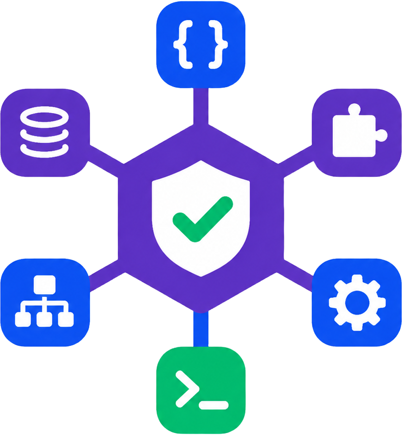

<p align="center">
  
</p>

<p align="center">
  <a href="README.md">English</a> | <a href="README_de.md">Deutsch</a>
</p>

<p align="center">
  
  
  
  
  
  
  <a href="https://www.linkedin.com/in/frank-richter-24657078/">
    
  </a>
</p>

# ManagedSkillHub Skill Registry

Governed skill registry for AI agents.

## Purpose

ManagedSkillHub turns reusable agent instructions into governed, versioned,
discoverable assets. Product managers, developers, and reviewers can maintain,
review, approve, version, and publish skills; coding agents such as Codex,
Claude, OpenCode, Gemini, Cursor, and Windsurf can discover and consume only
published skills through a stable public API.

The goal is to move skill reuse out of chat history, local folders, and ad-hoc
copy/paste workflows into an auditable registry with clear ownership, review
state, immutable published versions, and machine-readable contracts.

## Why It Matters

- Agents can bootstrap themselves from `GET /discover`, `GET /howToPropose`,
  `GET /openapi.yaml`, and the published skill APIs without UI access or custom
  client code.
- Published skills can be downloaded as deterministic version packages, so local
  agents do not have to reconstruct files from prose.
- Anyone can submit a proposal without admin credentials; admins can review,
  convert proposals into drafts, approve, publish, or reject them.
- Optional LLM judgers can assess proposals/files before publication. With
  `AUTO_PUBLISH_ON_GREEN=true`, low-risk proposals can be published
  automatically after green judgements, while `noop` judgements are treated as
  not judged unless explicitly overridden.
- Agents are expected to run duplicate preflight checks before submission,
  compare metadata and file fingerprints, surface similar existing skills or
  proposals, and ask the user before uploading likely duplicates.
- Operators can run the registry locally with SQLite, use MySQL for catalog and
  search projections, or add future provider adapters behind the same ports.

## Workflow At A Glance

1. Agents search and download published skills through public read endpoints.
2. Agents build a normalized proposal package, validate references, scan for
   secrets/PII, and run duplicate checks.
3. Agents submit proposals and attach files without admin credentials, then poll
   the public status URL.
4. A human admin can review, edit metadata, create drafts, approve, publish, or
   reject. Alternatively, configured auto-publish can publish green, eligible
   proposals after real judgements.
5. Published versions become available immediately through the public API and
   deterministic package download.

## Status

The greenfield MVP and EPIC-002 agent workbench hardening are implemented. The
next product direction is tracked in
[`EPIC-003`](./docs/roadmap/EPIC-003-english-first-localization-and-agent-contracts.md):
English-first documentation and agent-facing contracts with a bilingual web UI.

## Important Documents

1. [`AGENTS.md`](./AGENTS.md) - rules for coding agents
2. [`docs/setup/BUILD_AND_CHECKS.md`](./docs/setup/BUILD_AND_CHECKS.md) - build,
   checks, and local startup
3. [`docs/setup/TESTING.md`](./docs/setup/TESTING.md) - local testing and API
   checks
4. [`docs/setup/ENVIRONMENT.md`](./docs/setup/ENVIRONMENT.md) - layered root `.env` and `.env.secrets`,
   SQLite/MySQL providers, judger settings, and auto-publish flags
5. [`docs/setup/AUTHENTIK.md`](./docs/setup/AUTHENTIK.md) - Authentik OIDC
   setup, staging gate, cutover, and rollback playbook
6. [`docs/setup/JUDGER_ADAPTERS.md`](./docs/setup/JUDGER_ADAPTERS.md) - add
   OpenAI/Vercel AI SDK or custom judger adapters
7. [`docs/product/AGENT_OPERATIONS.md`](./docs/product/AGENT_OPERATIONS.md) -
   local agent runbooks for SQLite, MySQL, judgers, and auto-publish
8. [`docs/product/AGENT_OIDC_DEVICE_FLOW.md`](./docs/product/AGENT_OIDC_DEVICE_FLOW.md)
   - runtime agent linkout and Device Authorization behavior
9. [`docs/setup/DEPLOYMENT.md`](./docs/setup/DEPLOYMENT.md) - server install
   and runtime layout
10. [`docs/roadmap/MASTER_PLAN.md`](./docs/roadmap/MASTER_PLAN.md) - vision,
   scope, and phases
11. [`docs/roadmap/EPIC-003-english-first-localization-and-agent-contracts.md`](./docs/roadmap/EPIC-003-english-first-localization-and-agent-contracts.md)
   - English-first localization and agent-facing contracts
12. [`docs/roadmap/EPIC-011-authentik-oidc-and-delegated-agent-authentication.md`](./docs/roadmap/EPIC-011-authentik-oidc-and-delegated-agent-authentication.md)
   - Authentik/OIDC implementation plan and acceptance gate
13. [`docs/progress/NEXT_STEPS.md`](./docs/progress/NEXT_STEPS.md) - current next
    steps
14. [`docs/decisions/`](./docs/decisions/) - architecture decision records
15. [`docs/index.md`](./docs/index.md) - documentation index

## Quickstart

```bash
cd /path/to/managed-skill-hub

# 1. Install dependencies
npm ci --legacy-peer-deps

# 2. Run checks
./scripts/check.sh

# 3. Create local configuration
cp .env.example .env
cp .env.secrets.example .env.secrets
chmod 600 .env .env.secrets

# Local simple-auth secret in .env.secrets:
# ADMIN_PASSWORD=admin
# Optional BCrypt hash:
# node -e "console.log(require('bcryptjs').hashSync('admin', 10))"

# 4. Start development servers
# Option A: single command from repository root
npm run dev

# Option B: start manually
# Terminal 1:
npm --workspace=apps/api run dev

# Terminal 2:
npm --workspace=apps/web run dev
```

- Frontend: http://localhost:3041
- API: http://localhost:3040
- Admin login: http://localhost:3041/admin/login

## Automated Smoke Test

```bash
bash scripts/smoke-test.sh
```

The script starts the backend, checks health, public read paths, admin login,
skill creation, and the proposal workflow, then stops the backend again. See
[`docs/setup/TESTING.md`](./docs/setup/TESTING.md) for details.

## Production Build And Start

```bash
npm run build:prod
node apps/api/dist/server.js
```

## Provider And Judger Setup

- SQLite is the default local provider (`CATALOG_PROVIDER=sqlite`,
  `SEARCH_PROVIDER=sqlite`).
- MySQL is configured through `CATALOG_PROVIDER=mysql`, `SEARCH_PROVIDER=mysql`,
  and `MYSQL_*`; see [`docs/product/AGENT_OPERATIONS.md`](./docs/product/AGENT_OPERATIONS.md).
- `JUDGER_PROVIDER=noop` is the safe default and blocks auto-publish unless
  explicitly overridden.
- `JUDGER_PROVIDER=vercel-ai-sdk` enables the built-in Vercel AI SDK adapter;
  OpenAI-backed models require `OPENAI_API_KEY`.
- Custom judgers use any non-built-in `JUDGER_PROVIDER` value plus
  `JUDGER_ADAPTER_PATH`; see [`docs/setup/JUDGER_ADAPTERS.md`](./docs/setup/JUDGER_ADAPTERS.md).

## Validation

```bash
./scripts/check.sh
```

This runs:

- structure and documentation checks
- `npm run lint`
- `npm run typecheck`
- `npm run test`

## Stack

- **Backend:** TypeScript, Fastify, Hexagonal Architecture, Domain-Driven Design
- **Frontend:** React, TypeScript, Vite
- **API:** OpenAPI-first, public read path without auth, protected admin path
- **Persistence:** file-based artifact storage in `data/skills/`, SQLite FTS5
  search index, and SQLite metadata projection
- **Search:** keyword/BM25, fulltext, regex
- **Auth:** independently configurable simple/OIDC admin auth and
  none/bearer/OIDC agent areas with Authentik Device Authorization
- **Judger:** Noop default with optional Vercel AI SDK provider. Custom judgers
  can be loaded through `JUDGER_ADAPTER_PATH`.
- **Deployment:** `/path/to/deploy-root/src` is replaceable,
  `/path/to/deploy-root/data` is persistent

## Repository Layout

```text
apps/
  api/        Fastify backend
  web/        React frontend
packages/
  openapi/    OpenAPI spec and generated types
  shared/     shared technical types
data/
  skills/     published skill artifacts
  proposals/  submitted proposals
  index/      SQLite FTS5 search index and metadata projection
  audit/      JSONL audit logs
  backups/    backup archives
docs/         documentation, ADRs, specs
scripts/      build, deploy, backup, and test scripts
```

## MVP Boundaries

- No production deployment is included.
- Authentik production activation remains deployment-specific and requires the
  real staging gate; normal CI uses a deterministic local OIDC/JWKS provider.
- No hosted third-party judger service is included; deployers configure the
  built-in Vercel AI SDK provider or supply their own adapter.
- No semantic/vector search.
- Custom judger adapters run behind the provider-neutral `SkillJudgerPort`.
- No MCP server.
- No automated backups.

## Agent Bootstrap

Agents should start with the public API:

```bash
curl http://localhost:3040/discover
curl http://localhost:3040/howToPropose
curl http://localhost:3040/openapi.yaml
```

Agent-facing API guidance is English. Agents must still communicate with the
user in the language the user is currently using unless the user explicitly asks
for another language.

The legacy TypeScript reference client under `agents/registry-bootstrap/` is
kept for reference only. The recommended integration path is direct API usage
through `GET /discover` and `GET /openapi.yaml`.
