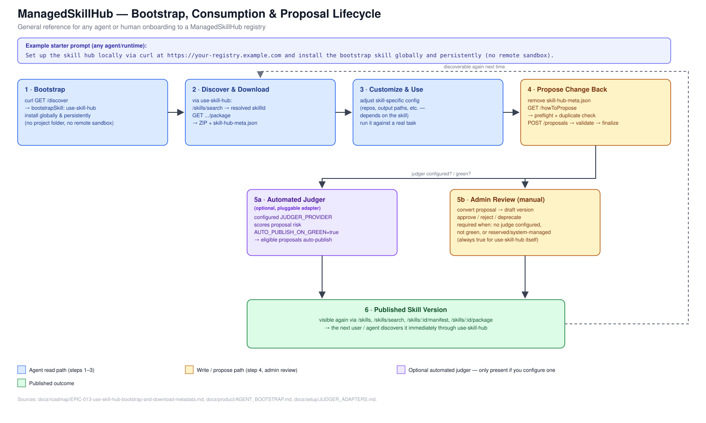
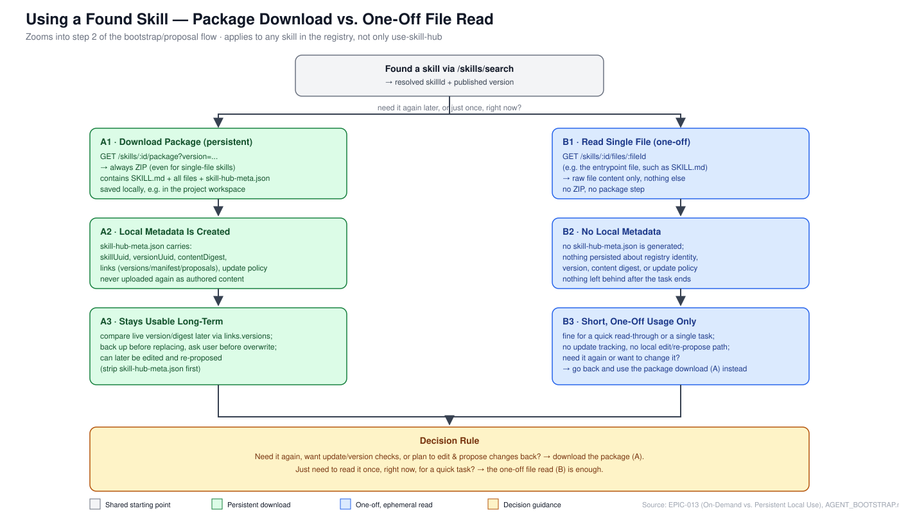

# Skill Hub Flow Diagrams

## Purpose

Visual companions to [`AGENT_BOOTSTRAP.md`](./AGENT_BOOTSTRAP.md) and
[`EPIC-013-use-skill-hub-bootstrap-and-download-metadata.md`](../roadmap/EPIC-013-use-skill-hub-bootstrap-and-download-metadata.md).
General-purpose reference for anyone onboarding an agent (Cursor, Claude,
Codex, ...) or a non-engineer user to this registry — not tied to any single
session, skill, or audience.

For a simplified version aimed at non-technical users, see
[`SKILL_HUB_FOR_USERS.md`](./SKILL_HUB_FOR_USERS.md).

## Diagram 1: Bootstrap & Proposal Lifecycle

Source: [`diagrams/skill-hub-bootstrap-and-proposal-flow.svg`](./diagrams/skill-hub-bootstrap-and-proposal-flow.svg)
(plain SVG, no build step — open directly or embed in a slide).

### What it shows

1. **Bootstrap** — a one-line starter prompt resolves to `curl GET /discover`,
   which advertises `bootstrapSkill`. The agent installs `use-skill-hub`
   globally and persistently (not project-scoped, not a remote-sandbox
   fetch), matching the product decision in EPIC-013.
2. **Discover & Download** — from then on, all further skill discovery goes
   through `use-skill-hub` calling `/skills/search` and `/skills/:id/package`,
   never a manual one-off `curl` against a single skill.
3. **Customize & Use** — the user (or agent) adjusts the downloaded skill's
   own configuration (repos, output paths, or whatever that skill exposes)
   and runs it against a real task.
4. **Propose Change Back** — optional write path when someone wants to
   submit an improved skill version: strip `skill-hub-meta.json`, read
   `/howToPropose`, then create/validate/finalize the proposal.
5. **Review** — either an optional **automated judger** (a pluggable
   `JUDGER_PROVIDER` adapter you configure yourself, see
   [`JUDGER_ADAPTERS.md`](../setup/JUDGER_ADAPTERS.md); scores risk and can
   auto-publish when green and `AUTO_PUBLISH_ON_GREEN=true`) or a human
   **admin review** when no judger is configured, the result isn't green, or
   the target is reserved/system-managed (always true for `use-skill-hub`
   itself).
6. **Published** — the new version becomes discoverable again through the
   same read path, closing the loop back to step 2.

Step 5a is entirely optional: a fresh, self-hosted registry with no judger
configured only ever takes the 5b (admin review) path.

## Diagram 2: Package Download vs. One-Off File Read

Source: [`diagrams/skill-download-vs-oneoff-use.svg`](./diagrams/skill-download-vs-oneoff-use.svg).
Zooms into step 2 of Diagram 1 ("Discover & Download") and applies to **any**
skill in the registry, not just `use-skill-hub`.

### What it shows

Once a skill has been found through `/skills/search`, there are two distinct
ways to actually use it, per `EPIC-013`'s "On-Demand Skill Use" vs.
"Persistent Local Use" sections:

- **A · Package download (persistent).** `GET /skills/:id/package?version=...`
  always returns a ZIP — even for a single-file skill — containing the
  published files plus a generated `skill-hub-meta.json`. That metadata file
  is what makes later version/update checks, backups, and re-proposals
  possible. This is the recommended path for anything that will be reused.
- **B · Single-file read (one-off).** `GET /skills/:id/files/:fileId` (e.g.
  the entrypoint `SKILL.md`) returns raw file content only. No metadata is
  written anywhere, so there is nothing to track or update later. This is
  the right choice for a quick, single-use read — and the wrong choice if
  the user will need the skill again or wants to edit and re-propose it.

### Decision rule

Need it again, want update/version checks, or plan to edit and propose
changes back → download the package. Otherwise, a one-off file read is
enough and avoids leaving local state behind.
