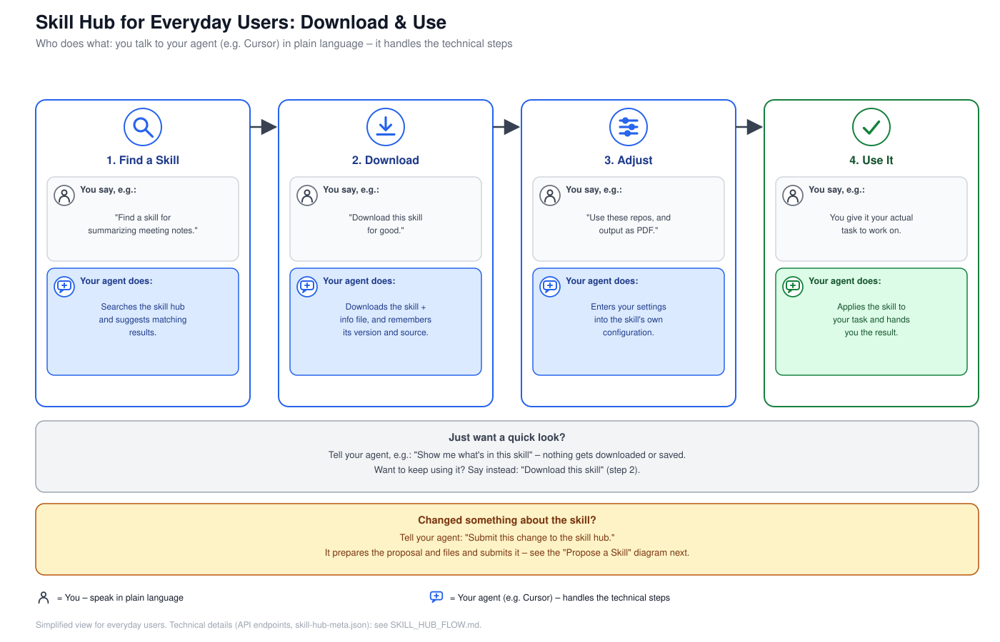
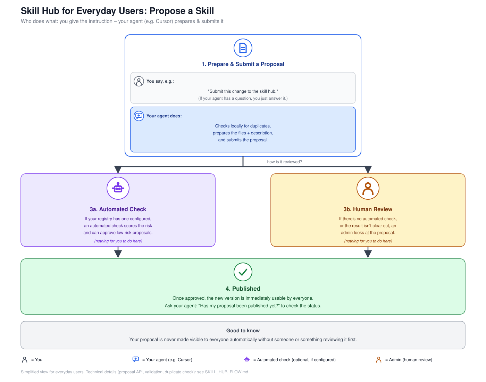

# Skill Hub for Everyday Users

## What is this?

This page explains, in plain language, how ManagedSkillHub works for you as
a regular user — no technical background needed. There are two things you
can do with it:

1. **Download and use a skill** — you use a ready-made skill (e.g. for
   summarizing notes, drafting tickets, or validating a concept) inside your
   coding agent's project.
2. **Propose a skill** — you've adjusted an existing skill or built a new
   one and want to share it with others.

For the technical deep dive (API endpoints, roles/permissions, the optional
automated judger) see [`SKILL_HUB_FLOW.md`](./SKILL_HUB_FLOW.md) — this page
is the simplified version of that.

### Who does what?

You talk to your agent (e.g. Cursor, Claude, Codex) in plain language — it
handles the technical steps in the skill hub. Both diagrams below show this
throughout:

- **You say, e.g.:** — what you tell your agent, in plain language
- **Your agent does:** — what the agent then executes technically

## 1. Download & use a skill

In short:

- You tell your agent which **skill** you're looking for.
- You tell it to **download** the skill for good (not just look at it once) —
  it automatically remembers which version you have, so you can recognize
  updates later.
- You tell it what matters for your case (e.g. which repos or output format
  are relevant) — it fills that into the skill's own configuration.
- You give it your actual task — it **uses** the skill for that.

Just want a quick look instead of using the skill for good? Tell your agent
that — then a simple file read is enough, and no download is needed.

**Changed something about the skill afterwards?** Just tell your agent:
"Submit this change to the skill hub." It prepares the proposal and files
and submits it — that continues in section 2 below.

## 2. Propose a skill

In short:

- You tell your agent to **submit** your change — it checks locally for
  duplicates, prepares the files and description, and submits the proposal.
  If anything is unclear along the way, it asks you.
- The proposal gets **reviewed** — either by an optional automated check (if
  the registry has one configured) for low-risk proposals, or by a human
  admin when there's no automated check or the result isn't clear-cut. You
  don't need to do anything during this step.
- Once approved, the new version is **published** and immediately usable by
  everyone. You can ask your agent for the current status at any time.

Good to know: nothing is ever made visible to everyone automatically without
someone or something reviewing it first.

## Where can I find more details?

- Technical flow (bootstrap, discovery, proposal API, optional judger):
  [`SKILL_HUB_FLOW.md`](./SKILL_HUB_FLOW.md)
- Agent-facing bootstrap guide: [`AGENT_BOOTSTRAP.md`](./AGENT_BOOTSTRAP.md)
